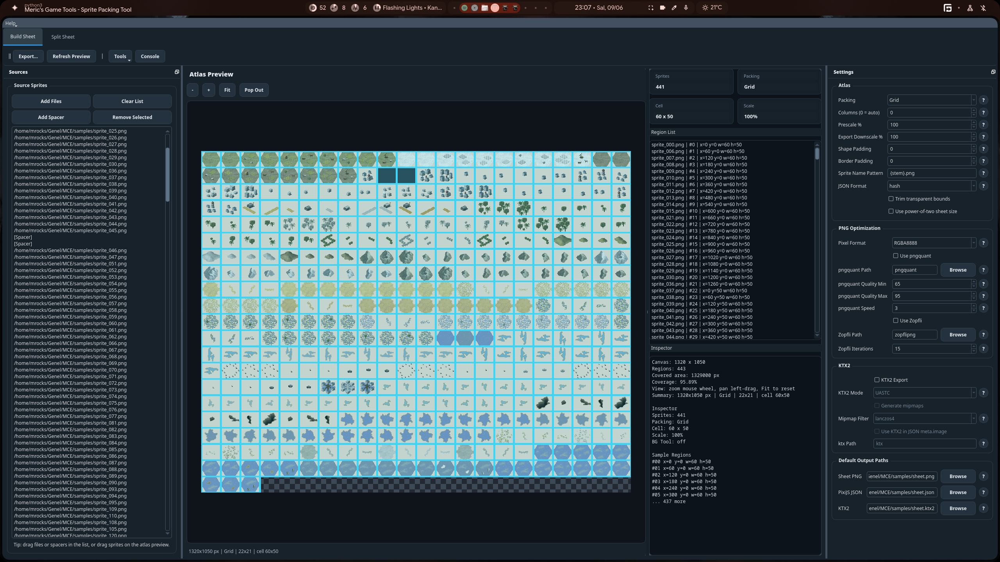
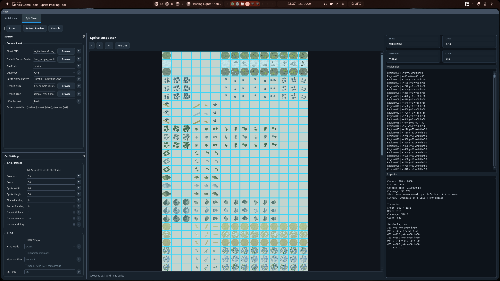

# Meric's Game Tools - Sprite Packing Tool

Desktop sprite atlas utility for building PixiJS-compatible PNG/JSON atlases, splitting existing sprite sheets, previewing regions, and exporting optional KTX2 textures.





Repository: https://github.com/merchizm/mgt-sprite-packing-tool

## Features

- Build sprite atlases from individual PNG/JPG/WebP/BMP images.
- Reorder source sprites in the list or directly on the atlas preview.
- Insert colored spacer cells to visually group sprites.
- Packing modes: Grid, Basic shelf packing, MaxRects, and Polygon metadata mode.
- Prescale source sprites and downscale the final exported atlas.
- Trim transparent bounds and remove or replace source background colors.
- Preview transparency with a checkerboard background.
- Simulate pixel formats in PNG output: RGBA8888, RGB888, RGB565, RGBA4444.
- Optional PNG optimization with pngquant and zopflipng.
- Optional KTX2 export with Khronos KTX-Software.
- Split existing sheets by grid or alpha-detected regions.

## Install

Use Python 3.10+.

```bash
python -m venv .venv
source .venv/bin/activate
pip install -r requirements.txt
```

Optional external tools:

- `pngquant` for lossy PNG palette optimization.
- `zopflipng` for Zopfli PNG compression.
- `ktx` from KTX-Software for KTX2 export.

The app has path fields for these tools, so they do not need to be Python dependencies.

## Run

```bash
python main.py
```

## Build Sheet Workflow

1. Open the `Build Sheet` tab.
2. Add sprites with `Add Files` or drag images into the source list.
3. Reorder sprites in the source list or drag sprite/spacer regions on the atlas preview.
4. Use `Add Spacer` to insert a spacer after the selected list item or selected preview region.
5. Use `Tools > Set Spacer Color` to color every spacer cell, including fully transparent spacers.
6. Configure packing, padding, prescale, export downscale, pixel format, and optimization settings.
7. Click `Export...` to write the PNG atlas and PixiJS JSON.

## Tools Menu

- `Toggle Checker Background`: preview-only transparency checkerboard.
- `Set Atlas Background Color`: fills sprite cells in the exported atlas.
- `Clear Atlas Background`: returns sprite cells to transparent.
- `Set Spacer Color`: changes all spacer colors, or creates a spacer when none exists.
- `Remove Sprite Background`: opens a sprite preview dialog where you can choose a sprite, randomize the sprite, click a pixel, or type a source color and tolerance. The chosen source color is removed from all sprites.
- `Replace Sprite Background`: uses the same source picker flow and replaces the chosen source color across all sprites with a typed or picked replacement color.
- `Reset Sprite Background Tools`: disables background remove/replace processing.

## Split Sheet Workflow

1. Open the `Split Sheet` tab.
2. Select a source sheet.
3. Choose grid slicing or alpha detection settings.
4. Select detected regions in the preview or region list.
5. Export all regions or only selected regions.

## Mouse Controls

- Mouse wheel: zoom preview.
- Left-drag empty preview area: pan preview.
- Click sprite, spacer, or region: select it.
- Ctrl + click: add or remove one item from selection.
- Shift + click: select a range from the last selected item.
- Ctrl + Shift + click: add a range to the current selection.
- Left-drag sprite/spacer in Build Sheet preview: reorder it in the source list.
- `Fit`: reset preview zoom and framing.

## Output Notes

- Spacers reserve visible atlas space but do not create PixiJS frame entries.
- Polygon mode currently places sprites by rectangle bounds and writes compact alpha-outline `vertices` metadata.
- Pixel formats are simulated inside exported PNG files; no raw pixel buffers are written.
- If pngquant or zopflipng is enabled but the executable is missing, export fails with a clear error.
